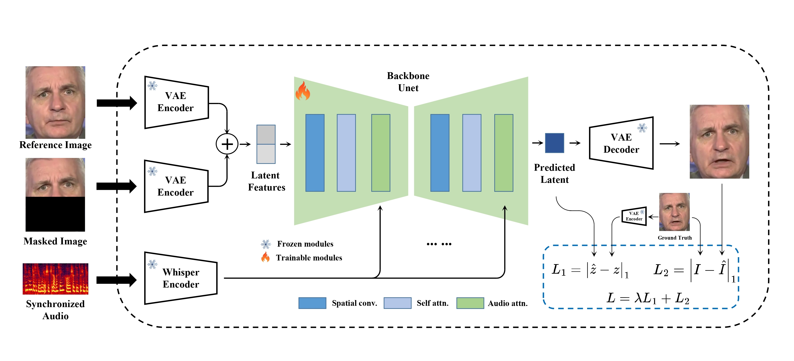

# MuseTalk

MuseTalk: Real-Time High Quality Lip Synchronization with Latent Space Inpainting


This is the unofficial train code of MuseTalk. "Real-Time High Quality Lip Synchronization with Latent Space Inpainting", Most code from https://github.com/TMElyralab/MuseTalk . This project try to realize the train code and add some experiments for it.


# Overview
`MuseTalk` is a real-time high quality audio-driven lip-syncing model trained in the latent space of `ft-mse-vae`,

## Model

MuseTalk was trained in latent spaces, where the images were encoded by a freezed VAE. The audio was encoded by a freezed `whisper-tiny` model. The architecture of the generation network was borrowed from the UNet of the `stable-diffusion-v1-4`, where the audio embeddings were fused to the image embeddings by cross-attention. 

Note that although we use a very similar architecture as Stable Diffusion, MuseTalk is distinct in that it is **NOT** a diffusion model. Instead, MuseTalk operates by inpainting in the latent space with a single step.


In the experiment, it was found that when half of the face is masked, if the nose is within the masked area, the generated nose will exhibit differences, leading to flickering in the video. So We try to and the landmark control to the model. We also and lpip loss for the generate face.


## Installation
To prepare the Python environment and install additional packages such as opencv, diffusers, mmcv, etc., please follow the steps below:
### Build environment

We recommend a python version >=3.10 and cuda version =11.7. Then build environment as follows:

```shell
pip install -r requirements.txt
```

### mmlab packages
```bash
pip install --no-cache-dir -U openmim 
mim install mmengine 
mim install "mmcv>=2.0.1" 
mim install "mmdet>=3.1.0" 
mim install "mmpose>=1.1.0" 
```

### Download ffmpeg-static
Download the ffmpeg-static and
```
export FFMPEG_PATH=/path/to/ffmpeg
```
for example:
```
export FFMPEG_PATH=/musetalk/ffmpeg-4.4-amd64-static
```
### Download weights
You can download weights manually as follows:

1. Download our trained [weights](https://huggingface.co/TMElyralab/MuseTalk).

2. Download the weights of other components:
   - [sd-vae-ft-mse](https://huggingface.co/stabilityai/sd-vae-ft-mse)
   - [whisper](https://openaipublic.azureedge.net/main/whisper/models/65147644a518d12f04e32d6f3b26facc3f8dd46e5390956a9424a650c0ce22b9/tiny.pt)
   - [dwpose](https://huggingface.co/yzd-v/DWPose/tree/main)
   - [face-parse-bisent](https://github.com/zllrunning/face-parsing.PyTorch)
   - [resnet18](https://download.pytorch.org/models/resnet18-5c106cde.pth)


Finally, these weights should be organized in `models` as follows:
```
./models/
├── musetalk
│   └── musetalk.json
│   └── pytorch_model.bin
├── dwpose
│   └── dw-ll_ucoco_384.pth
├── face-parse-bisent
│   ├── 79999_iter.pth
│   └── resnet18-5c106cde.pth
├── sd-vae-ft-mse
│   ├── config.json
│   └── diffusion_pytorch_model.bin
└── whisper
    └── tiny.pt
```
## Quickstart

### Inference
Here, we provide the inference script. 
```
python -m scripts.inference --inference_config configs/inference/test.yaml 
```
configs/inference/test.yaml is the path to the inference configuration file, including video_path and audio_path.
The video_path should be either a video file, an image file or a directory of images. 

You are recommended to input video with `25fps`, the same fps used when training the model. If your video is far less than 25fps, you are recommended to apply frame interpolation or directly convert the video to 25fps using ffmpeg.

#### Use of bbox_shift to have adjustable results
:mag_right: We have found that upper-bound of the mask has an important impact on mouth openness. Thus, to control the mask region, we suggest using the `bbox_shift` parameter. Positive values (moving towards the lower half) increase mouth openness, while negative values (moving towards the upper half) decrease mouth openness.

You can start by running with the default configuration to obtain the adjustable value range, and then re-run the script within this range. 

For example, in the case of `Xinying Sun`, after running the default configuration, it shows that the adjustable value rage is [-9, 9]. Then, to decrease the mouth openness, we set the value to be `-7`. 
```
python -m scripts.inference --inference_config configs/inference/test.yaml --bbox_shift -7 
```
:pushpin: More technical details can be found in [bbox_shift](assets/BBOX_SHIFT.md).

#### Combining MuseV and MuseTalk

As a complete solution to virtual human generation, you are suggested to first apply [MuseV](https://github.com/TMElyralab/MuseV) to generate a video (text-to-video, image-to-video or pose-to-video) by referring [this](https://github.com/TMElyralab/MuseV?tab=readme-ov-file#text2video). Frame interpolation is suggested to increase frame rate. Then, you can use `MuseTalk` to generate a lip-sync video by referring [this](https://github.com/TMElyralab/MuseTalk?tab=readme-ov-file#inference).

#### :new: Real-time inference

Here, we provide the inference script. This script first applies necessary pre-processing such as face detection, face parsing and VAE encode in advance. During inference, only UNet and the VAE decoder are involved, which makes MuseTalk real-time.

```
python -m scripts.realtime_inference --inference_config configs/inference/realtime.yaml --batch_size 4
```
configs/inference/realtime.yaml is the path to the real-time inference configuration file, including `preparation`, `video_path` , `bbox_shift` and `audio_clips`. 

1. Set `preparation` to `True` in `realtime.yaml` to prepare the materials for a new `avatar`. (If the `bbox_shift` has changed, you also need to re-prepare the materials.)
1. After that, the `avatar` will use an audio clip selected from `audio_clips` to generate video.
    ```
    Inferring using: data/audio/yongen.wav
    ```
1. While MuseTalk is inferring, sub-threads can simultaneously stream the results to the users. The generation process can achieve 30fps+ on an NVIDIA Tesla V100.
1. Set `preparation` to `False` and run this script if you want to genrate more videos using the same avatar.

##### Note for Real-time inference
1. If you want to generate multiple videos using the same avatar/video, you can also use this script to **SIGNIFICANTLY** expedite the generation process.
1. In the previous script, the generation time is also limited by I/O (e.g. saving images). If you just want to test the generation speed without saving the images, you can run
```
python -m scripts.realtime_inference --inference_config configs/inference/realtime.yaml --skip_save_images
```

# Acknowledgement
1. We thank open-source components like [whisper](https://github.com/openai/whisper), [dwpose](https://github.com/IDEA-Research/DWPose), [face-alignment](https://github.com/1adrianb/face-alignment), [face-parsing](https://github.com/zllrunning/face-parsing.PyTorch), [S3FD](https://github.com/yxlijun/S3FD.pytorch). 
1. MuseTalk has referred much to [diffusers](https://github.com/huggingface/diffusers) and [isaacOnline/whisper](https://github.com/isaacOnline/whisper/tree/extract-embeddings).
1. MuseTalk has been built on [HDTF](https://github.com/MRzzm/HDTF) datasets.
